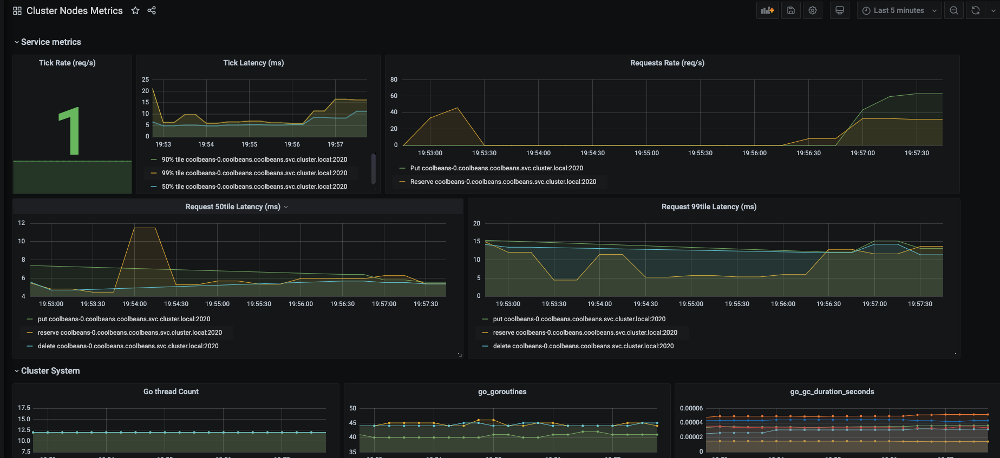

Example: How to get coolbeans Metrics
=====================================

This guide provides an example metrics setup.

- [Objectives](#objectives)
- [Setup port forwarding](#setup-port-forwarding)
- [Setup Prometheus](#setup-prometheus)
- [Run a grafana server](#setup-grafana)

Objectives
----------

- Setup port forwarding from the kubernetes cluster's Prometheus instance to your machine.
- Setup and run a grafana server to talk to the cluster.

Requirements
------------

- A coolbeans & beanstalkd service running on kubernetes.

Setup Prometheus
----------------

Apply the Prometheus config map and the deployment yaml

    kubectl apply -f k8s/prometheus/0-configmap.yaml
    kubectl apply -f k8s/prometheus/1-deployment.yaml

Setup port forwarding
---------------------

We will use kubernetes [port forwarding](https://kubernetes.io/docs/tasks/access-application-cluster/port-forward-access-application-cluster/) to forward requests to the tcp port of the Prometheus service

### Verify the Prometheus service is running

Query via kubectl to get the port address of the beanstalkd proxy

    kubectl -n coolbeans get service prometheus
    
    NAME         TYPE        CLUSTER-IP      EXTERNAL-IP   PORT(S)    AGE
    prometheus   ClusterIP   10.200.12.203   <none>        9090/TCP   26m

### Setup port forwarding 

Use kubectl port-forward using the service  resource name to port forward to.

    kubectl -n coolbeans port-forward service/prometheus 9090:9090

    Forwarding from 127.0.0.1:9090 -> 9090
    Forwarding from [::1]:9090 -> 9090
    Handling connection for 9090
    Handling connection for 9090

### Open the Prometheus console in a browser window

Open http://localhost:9090/ in a browser window, and check to see if the Prometheus web console shows up.

Setup Grafana
-------------

On your local machine, you can view the metrics via Grafana. 

Here are the steps to configure a local Grafana instance.

- Download & install Grafana. You can find more information from the [Grafana installation page](https://grafana.com/grafana/download).

- Once you have Grafana installed, create a new Prometheus datasource with the HTTP url set to `http://localhost:9090`

    - [More information on how to configure a Prometheus data source for Grafana](https://prometheus.io/docs/visualization/grafana/#creating-a-prometheus-data-source)

- Import [this dashboard](../dashboard/grafana-cluster-node.json)

    - [More information on how to import a dashboard](https://grafana.com/docs/grafana/latest/reference/export_import/#importing-a-dashboard)

- Below is an sample metrics dashboard

